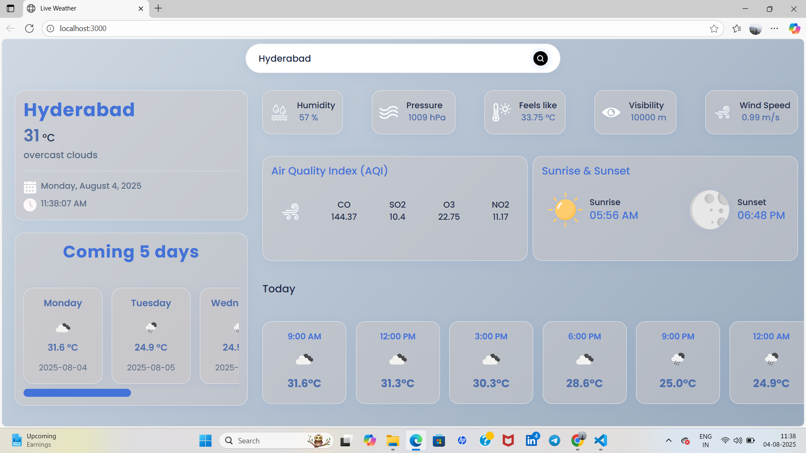
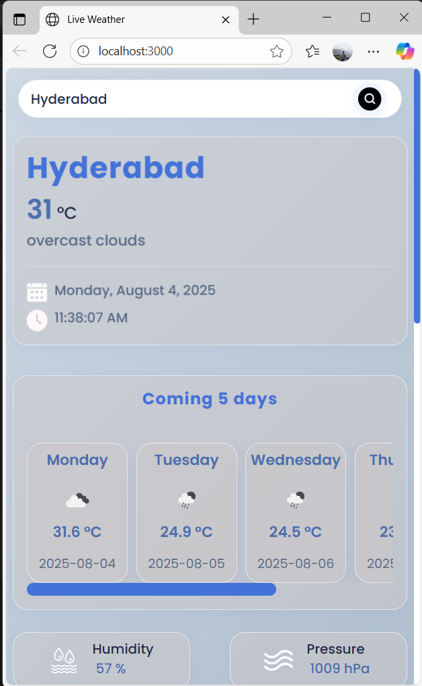
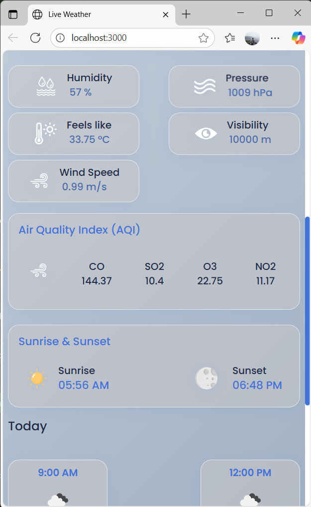
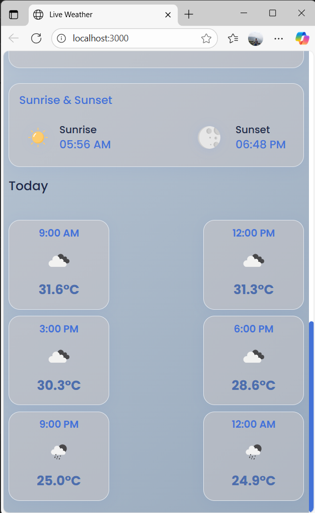

# 🌤️ Live Weather App

A modern, responsive weather forecast web application built using HTML, CSS, JavaScript, and the OpenWeather API's. This app provides current weather details and a 5-day forecast in a visually appealing card-based layout, complete with smooth animations and mobile support.

---

## 🔍 Features

- 🌦️ **Live Weather**: Get real-time weather data for any city worldwide.
- 📅 **5-Day Forecast**: View detailed temperature trends with scrollable cards.
- 🧭 **Dynamic Location Support**: Fetch weather using your current coordinates or search any location.
- 🎨 **Professional UI**: Clean, modern interface with animated elements and stylish transitions.
- 📱 **Responsive Design**: Optimized for all screen sizes — from desktops to mobiles.
- 💡 **Future-Ready**: Code is structured for adding dark mode toggle, alerts, or weather icons easily.

---

## 🛠️ Tech Stack

| Frontend  | APIs         | Tools      |
|-----------|--------------|------------|
| HTML5     | OpenWeather  | Git        |
| CSS3      | Geolocation  | GitHub     |
| JavaScript |             |            |

---

## 🖼️ Screenshots

### 💻 Desktop View


### 📱 Mobile View




---

## 🚀 How to Run Locally

1. **Clone this repository:**
   ```bash
   git clone https://github.com/your-username/weather-app.git
